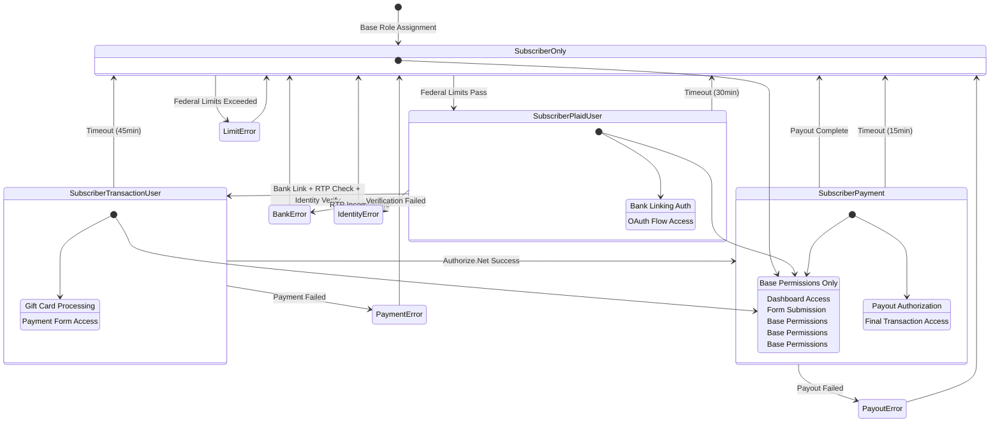
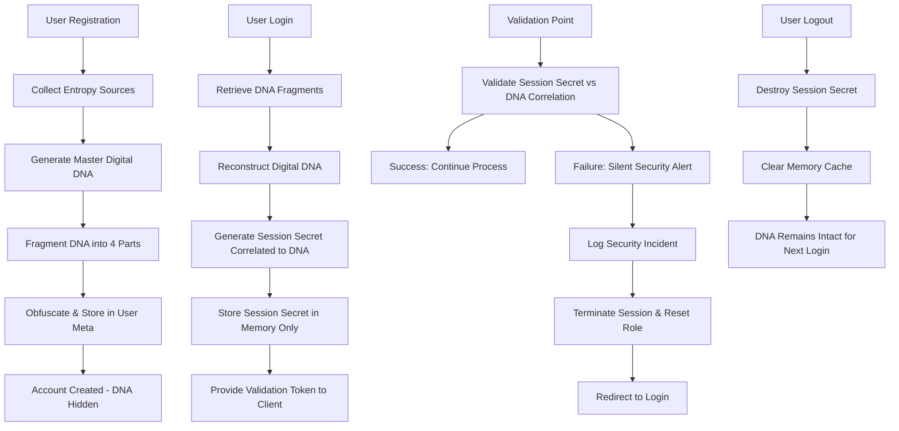

# **PRODUCTION-READY PRODUCT REQUIREMENTS DOCUMENT (PRD) SECTIONS 4 - 9**


## 4. User Roles & Workflow

### 4.1. WordPress-Compliant Role Management System

The system implements a **WordPress best practice approach**: **Subscriber + 1 Progressive Role** pattern that maintains security while following WordPress standards:

#### Base Role: Subscriber (Permanent)
- **Assignment**: Maintained throughout entire journey - never removed
- **Permissions**: Core WordPress dashboard access, form submissions, base user functionality
- **WordPress Compliance**: Ensures compatibility with themes/plugins expecting users to have subscriber role
- **Security Benefit**: Provides consistent permission baseline and audit trail

#### Role 2: Plaid User  
- **Assignment**: **Subscriber + Plaid User** (dual roles)
- **Entry Conditions**: Subscriber passes federal limits; RoleManager assigns Plaid User with 30-minute expiry
- **Permissions**: Launch Plaid Link OAuth and access Plaid-provided banking metadata
- **Duration**: 30-minute expiry with automatic cleanup
- **Actions**: Perform Secret Validation #1, launch Plaid Link, exchange public_token for access_token, store encrypted token, run RTP capability and identity checks, perform Secret Validation #2
- **Success Path**: Transition Plaid User → Transaction User and persist encrypted Plaid token
- **Failure Paths**: Secret validation failed, link cancelled, authentication failed after retries, bank incompatible with RTP/FedNow, identity mismatch, timeout
    - **Action**: Clear temporary tokens, revert to Subscriber only

#### Progressive Role 2: Transaction User  
- **Assignment**: **Subscriber + Transaction User** (dual roles)
- **Entry Conditions**: Successful bank verification and RTP compatibility confirmed
- **Permissions**: Gift card transaction processing, payment form access
- **Duration**: 45-minute expiry with automatic cleanup
- **Actions**: Process gift card transactions, accept payment terms
- **Success Path**: Remove Transaction User role, add PAYMENT role
- **Failure Paths**: Payment declined, transaction errors, timeout
  - **Action**: Remove Transaction User role, maintain Subscriber only

#### Progressive Role 3: PAYMENT
- **Assignment**: **Subscriber + PAYMENT** (dual roles)
- **Entry Conditions**: Successful Authorize.Net payment processing
- **Permissions**: Payout request authorization, final transaction completion
- **Duration**: 15-minute expiry with automatic cleanup
- **Actions**: Authorize payout via Plaid RTP/FedNow, complete transaction
- **Success Path**: Remove PAYMENT role, return to Subscriber only
- **Failure Paths**: Payout failures, network issues, timeout
  - **Action**: Remove PAYMENT role, maintain Subscriber only

### 4.1.1. WordPress Best Practice Benefits

**✅ Security Advantages:**
- **Principle of Least Privilege**: Users only have permissions needed for current stage
- **Progressive Enhancement**: Each role adds only necessary capabilities
- **Automatic Cleanup**: Expired roles are automatically removed, reverting to safe baseline
- **Audit Trail**: Subscriber role provides consistent identity for logging/tracking

**✅ WordPress Compatibility:**
- **Plugin Compatibility**: Themes/plugins expecting subscriber role continue to work
- **Core Integration**: Leverages WordPress's native multi-role support properly
- **Permission Queries**: `current_user_can()` checks work as expected
- **User Queries**: Can still query users by subscriber role for reporting

**✅ Operational Benefits:**
- **Clear State Management**: Always know user's base role (subscriber) + current stage
- **Simplified Debugging**: Easy to identify which progressive role grants specific permissions
- **Role Transitions**: Clean add/remove operations instead of complex role swapping
- **Fail-Safe Design**: All error conditions revert to safe subscriber-only state

### 4.2. Role Management Implementation

```php
class RoleManager {
    const ROLE_SUBSCRIBER = 'subscriber';
    const ROLE_PLAID_USER = 'plaid_user';
    const ROLE_TRANSACTION_USER = 'transaction_user';
    const ROLE_PAYMENT = 'payment';
    
    // Role expiry times (seconds)
    const EXPIRY_PLAID_USER = 1800;      // 30 minutes
    const EXPIRY_TRANSACTION_USER = 2700; // 45 minutes
    const EXPIRY_PAYMENT = 900;          // 15 minutes
    
    /**
     * WordPress-compliant role management: Subscriber + 1 progressive role pattern
     * Maintains subscriber as base role, adds/removes progressive roles as needed
     */
    public function transition_user_role($user_id, $new_role) {
        $user = new WP_User($user_id);
        
        // Ensure user has subscriber role (base role)
        if (!$user->has_role(self::ROLE_SUBSCRIBER)) {
            $user->add_role(self::ROLE_SUBSCRIBER);
        }
        
        // Remove any existing progressive roles (but keep subscriber)
        $progressive_roles = [
            self::ROLE_PLAID_USER,
            self::ROLE_TRANSACTION_USER,
            self::ROLE_PAYMENT
        ];
        
        foreach ($progressive_roles as $role) {
            if ($user->has_role($role)) {
                $user->remove_role($role);
            }
        }
        
        // Add the new progressive role (unless reverting to subscriber only)
        if ($new_role !== self::ROLE_SUBSCRIBER && in_array($new_role, $progressive_roles)) {
            $user->add_role($new_role);
            
            // Set expiry timer for progressive role
            $expiry_time = time() + $this->get_role_expiry($new_role);
            update_user_meta($user_id, 'cfmgc_role_expiry', $expiry_time);
        } else {
            // Clear expiry when reverting to subscriber only
            delete_user_meta($user_id, 'cfmgc_role_expiry');
        }
        
        return true;
    }
    
    /**
     * Check if user has the specific progressive role
     * Always maintains subscriber as base role
     */
    public function user_has_progressive_role($user_id, $role) {
        $user = new WP_User($user_id);
        return $user->has_role($role) && $user->has_role(self::ROLE_SUBSCRIBER);
    }
    
    /**
     * Get user's current progressive role (excluding subscriber)
     */
    public function get_user_progressive_role($user_id) {
        $user = new WP_User($user_id);
        $progressive_roles = [
            self::ROLE_PAYMENT,           // Check highest priority first
            self::ROLE_TRANSACTION_USER,
            self::ROLE_PLAID_USER
        ];
        
        foreach ($progressive_roles as $role) {
            if ($user->has_role($role)) {
                return $role;
            }
        }
        
        return self::ROLE_SUBSCRIBER; // Base role only
    }
    
    private function get_role_expiry($role) {
        switch($role) {
            case self::ROLE_PLAID_USER:
                return self::EXPIRY_PLAID_USER;
            case self::ROLE_TRANSACTION_USER:
                return self::EXPIRY_TRANSACTION_USER;
            case self::ROLE_PAYMENT:
                return self::EXPIRY_PAYMENT;
            default:
                return 0;
        }
    }
    
    /**
     * Cleanup expired roles - maintains subscriber, removes expired progressive roles
     */
    public function cleanup_expired_roles($user_id) {
        $expiry = get_user_meta($user_id, 'cfmgc_role_expiry', true);
        
        if ($expiry && time() > $expiry) {
            // Role expired, revert to subscriber only
            $this->transition_user_role($user_id, self::ROLE_SUBSCRIBER);
            error_log("CFMGC: Expired role cleaned up for user {$user_id}");
        }
    }
}
```

### 4.3. WordPress-Compliant User Workflow



**WordPress Role Pattern**: Each state represents the user having **Subscriber** (permanent base role) plus zero or one progressive role. This maintains WordPress compatibility while providing security checkpoints through progressive permission enhancement.

---

## 5. API Integrations

### 5.1. Plaid OAuth 2.0 Integration

#### 5.1.0 Link Completion Orchestrator (Plaid User Gate)

```php
class LinkHandler {
    public function complete_bank_link($user_id, $public_token): bool|WP_Error {
        if (empty($public_token)) {
            return new WP_Error('missing_token', 'public_token required');
        }

        $user = new WP_User($user_id);
        if (!in_array(RoleManager::ROLE_PLAID_USER, (array) $user->roles, true)) {
            return new WP_Error('invalid_role', 'User must be Plaid User to complete bank link');
        }

        $validator = new ValidationManager();
        $sv = $validator->perform_secret_validation($user_id, 'post_bank_link');
        if (is_wp_error($sv)) { return $sv; }

        $oauth = new PlaidOAuth();
        $ex = $oauth->exchange_public_token($user_id, $public_token);
        if (is_wp_error($ex)) { return $ex; }

        $client = new PlaidClient();
        $rtp = $client->check_rtp_capability($ex['access_token']);
        if ($rtp !== true) {
            return is_wp_error($rtp) ? $rtp : new WP_Error('rtp_unavailable', 'Bank not compatible with RTP/FedNow');
        }

        $idv = $client->verify_identity($ex['access_token']);
        if ($idv !== true) {
            return is_wp_error($idv) ? $idv : new WP_Error('identity_failed', 'Identity verification failed');
        }

        (new RoleManager())->transition_user_role($user_id, RoleManager::ROLE_TRANSACTION_USER);
        return true;
    }
}


#### 5.1.1. Corrected Authentication Flow

class PlaidOAuth {
    private $client_id;
    private $secret;
    private $environment;

    public function __construct() {
        $this->client_id = CFMGC_PLAID_CLIENT_ID;
        $this->secret = CFMGC_PLAID_SECRET;
        $this->environment = CFMGC_PLAID_ENVIRONMENT; // 'production' or 'sandbox'
    }

    private function base_url(): string {
        return $this->environment === 'sandbox'
            ? 'https://sandbox.plaid.com'
            : 'https://production.plaid.com';
    }

    public function initiate_link_flow($user_id) {
        return $this->create_link_token($user_id);
    }

    private function create_link_token($user_id) {
        $response = wp_remote_post($this->base_url().'/link/token/create', [
            'headers' => [
                'Content-Type'=>'application/json',
                'PLAID-CLIENT-ID'=>$this->client_id,
                'PLAID-SECRET'=>$this->secret
            ],
            'body' => wp_json_encode([
                'client_name' => 'WP Admin Dashboard Optimizer',
                'country_codes' => ['US'],
                'language' => 'en',
                'user' => ['client_user_id' => strval($user_id)],
                'products' => ['auth','identity','transfer'],
                'required_if_supported_products' => ['identity'],
                'redirect_uri' => home_url('/plaid-oauth-callback'),
            ])
        ]);
        if (is_wp_error($response)) { return $response; }
        if (wp_remote_retrieve_response_code($response)!==200) {
            return new WP_Error('plaid_http_error','Plaid HTTP '.wp_remote_retrieve_response_code($response));
        }
        $body = json_decode(wp_remote_retrieve_body($response), true);
        return $body['link_token'] ?? new WP_Error('plaid_missing_link_token','No link_token returned');
    }

    public function exchange_public_token($user_id, $public_token) {
        $response = wp_remote_post($this->base_url().'/item/public_token/exchange', [
            'headers' => [
                'Content-Type'=>'application/json',
                'PLAID-CLIENT-ID'=>$this->client_id,
                'PLAID-SECRET'=>$this->secret
            ],
            'body' => wp_json_encode(['public_token' => $public_token])
        ]);
        if (is_wp_error($response)) { return $response; }
        if (wp_remote_retrieve_response_code($response)!==200) {
            return new WP_Error('plaid_http_error','Plaid HTTP '.wp_remote_retrieve_response_code($response));
        }

        $body = json_decode(wp_remote_retrieve_body($response), true);
        if (empty($body['access_token'])) {
            return new WP_Error('plaid_exchange_failed','Missing access_token from Plaid');
        }

        $enc = new EncryptionManager();
        update_user_meta($user_id, 'cfmgc_plaid_access_token', $enc->encrypt($body['access_token']));
        update_user_meta($user_id, 'cfmgc_plaid_item_id', sanitize_text_field($body['item_id'] ?? ''));

        return [
            'access_token'=>$body['access_token'],
            'item_id'=>$body['item_id']
        ];
    }
}


#### 5.1.2. RTP Compatibility Check

class PlaidClient {
    private $client_id;
    private $secret;
    private $environment;

    public function __construct() {
        $this->client_id = CFMGC_PLAID_CLIENT_ID;
        $this->secret = CFMGC_PLAID_SECRET;
        $this->environment = CFMGC_PLAID_ENVIRONMENT;
    }

    private function base_url(): string {
        return $this->environment === 'sandbox'
            ? 'https://sandbox.plaid.com'
            : 'https://production.plaid.com';
    }

    public function check_rtp_capability(string $access_token): bool|WP_Error {
        $resp = wp_remote_post($this->base_url().'/transfer/capabilities/get', [
            'headers' => [
                'Content-Type'=>'application/json',
                'PLAID-CLIENT-ID'=>$this->client_id,
                'PLAID-SECRET'=>$this->secret
            ],
            'body' => wp_json_encode(['access_token'=>$access_token])
        ]);
        if (is_wp_error($resp)) { return $resp; }
        if (wp_remote_retrieve_response_code($resp)!==200) {
            return new WP_Error('plaid_http_error','Plaid HTTP '.wp_remote_retrieve_response_code($resp));
        }

        $body = json_decode(wp_remote_retrieve_body($resp), true);
        foreach ($body['transfer_capabilities'] ?? [] as $cap) {
            if (($cap['type'] ?? null) === 'rtp' && ($cap['status'] ?? null) === 'available') {
                return true;
            }
        }
        return false;
    }

    public function verify_identity(string $access_token): bool|WP_Error {
        $resp = wp_remote_post($this->base_url().'/identity/get', [
            'headers' => [
                'Content-Type'=>'application/json',
                'PLAID-CLIENT-ID'=>$this->client_id,
                'PLAID-SECRET'=>$this->secret
            ],
            'body' => wp_json_encode(['access_token'=>$access_token])
        ]);
        if (is_wp_error($resp)) { return $resp; }
        if (wp_remote_retrieve_response_code($resp)!==200) {
            return new WP_Error('plaid_http_error','Plaid HTTP '.wp_remote_retrieve_response_code($resp));
        }

        $body = json_decode(wp_remote_retrieve_body($resp), true);
        // Implement real matching logic against user metadata
        return !empty($body['accounts']); // placeholder pass condition
    }
}


#### 5.1.3. Corrected Plaid Webhook Validation

```php
class PlaidWebhookHandler {
    private $client_id;
    private $secret;
    private $webhook_verification_endpoint;

    public function __construct() {
        $this->client_id = CFMGC_PLAID_CLIENT_ID;
        $this->secret = CFMGC_PLAID_SECRET;
        $this->webhook_verification_endpoint =
            CFMGC_PLAID_ENVIRONMENT==='sandbox'
                ? 'https://sandbox.plaid.com/webhook_verification_key/get'
                : 'https://production.plaid.com/webhook_verification_key/get';
    }

    public function verify_webhook(string $jwt, string $raw_body): bool {
        $header = $this->decode_jwt_header($jwt);
        if (($header['alg'] ?? '') !== 'ES256') {
            throw new Exception('Invalid JWT algorithm');
        }

        $jwk = $this->get_verification_key($header['kid']);
        if (!$this->verify_jwt($jwt, $jwk)) {
            throw new Exception('JWT verification failed');
        }

        $payload = $this->decode_jwt_payload($jwt);
        $body_hash = hash('sha256', $raw_body);
        if (!hash_equals($payload['request_body_sha256'] ?? '', $body_hash)) {
            throw new Exception('Body hash verification failed');
        }

        if (time() - ($payload['iat'] ?? 0) > 300) {
            throw new Exception('Webhook too old');
        }

        return true;
    }

    private function get_verification_key($kid) {
        $response = wp_remote_post($this->webhook_verification_endpoint, [
            'headers' => [
                'Content-Type'=>'application/json',
                'PLAID-CLIENT-ID'=>$this->client_id,
                'PLAID-SECRET'=>$this->secret
            ],
            'body' => wp_json_encode(['key_id' => $kid])
        ]);
        $body = json_decode(wp_remote_retrieve_body($response), true);
        return $body['key'];
    }

    // TODO: implement decode_jwt_header, decode_jwt_payload, verify_jwt
}

```

### 5.2 Authorize.Net via WS Form

Replace the entire current 5.2. The WS Form Authorize.Net Accept add‑on handles the client payment flow and keys. This plugin only listens to WS Form hooks after a successful paid submission.

#### 5.2.1 Prerequisites

WS Form PRO installed and licensed. Authorize.Net Accept add‑on installed and licensed. Site served over HTTPS. WS Form E‑Commerce fields present. Authorize.Net API Login ID, Transaction Key, and Client Key available from the Authorize.Net dashboard.

#### 5.2.2 Configuration in WS Form

#### 5.2.2. Corrected Authorize.Net Webhook Validation

```php
class AuthorizeWebhookHandler {
    private $signature_key;
    
    public function verify_webhook($body, $headers) {
        if (!isset($headers['X-ANET-Signature'])) {
            throw new Exception('Missing webhook signature');
        }
        
        $signature = strtoupper($headers['X-ANET-Signature']);
        $calculated_signature = strtoupper(hash_hmac('sha512', $body, $this->signature_key));
        
        if (!hash_equals($calculated_signature, $signature)) {
            throw new Exception('Webhook signature verification failed');
        }
        
        return true;
    }
    
    public function handle_webhook($body) {
        $data = json_decode($body, true);
        
        if ($data['eventType'] === 'net.authorize.payment.authcapture.created') {
            $this->handle_payment_success($data);
        }
        
        return true;
    }
    
    private function handle_payment_success($data) {
        $user_id = $data['payload']['customerId']; // Map to WordPress user ID
        
        // Transition user role to PAYMENT
        $role_manager = new RoleManager();
        $role_manager->transition_user_role($user_id, RoleManager::ROLE_PAYMENT);
        
        // Initiate payout process
        $payout_manager = new PayoutManager();
        $payout_manager->initiate_payout($user_id, $data['payload']);
    }
}
```

---


#### 5.2.3 Building the form

Use E‑Commerce fields: Price, Quantity, Cart Total. The Authorize.Net button charges the Cart Total by default. You may configure a fixed amount instead of the cart total. Map billing fields as needed using standard WS Form field mapping.

#### 5.2.4 Submission flow and errors

Errors are rendered by WS Form on the client and reflected in the submission object. If your form total is zero, no charge is attempted; use a fixed amount or ensure the cart total resolves to a positive value.

#### 5.2.5 Server‑side handoff (our plugin)

We do not process PANs and do not load Accept.js. Use either a Run WordPress Hook action configured "After other actions" with a tag you choose, or use the native wsf_submit_post_complete action. The handler must:

1\. Confirm the correct Form ID.

2\. Confirm WS Form marks payment success.

3\. Transition Transaction User → PAYMENT.

4\. Call PayoutManager::initiate_payout(...).

5\. On failure, log and revert to Subscriber.

Action-based (Run WordPress Hook set to cfmgc_payment_success, "After other actions"):

add_action('cfmgc_payment_success', function($form, $submit) {

$target_form_id = 123; // TODO: replace with production Form ID

if ((int)($form->id ?? 0) !== $target_form_id) { return; }

```

// TODO: Confirm payment success from $submit meta per WS Form add-on.

$user_id = get_current_user_id();

if (!$user_id) { return; }

(new RoleManager())->transition_user_role($user_id, RoleManager::ROLE_PAYMENT);

$payload = ['amount' => cfmgc_extract_cart_total($submit)]; // implement extractor

$result = (new PayoutManager())->initiate_payout($user_id, $payload);

if (is_wp_error($result)) {

(new ErrorManager())->handle_error_with_role_reset($user_id, $result);

}

```

}, 10, 2);

Native WS Form hook:

add_action('wsf_submit_post_complete', function($submit) {

$target_form_id = 123; // TODO: replace with production Form ID

if ((int)($submit->form_id ?? 0) !== $target_form_id) { return; }

```

// TODO: Confirm payment success flag from WS Form submission meta.

$user_id = get_current_user_id();

if (!$user_id) { return; }

(new RoleManager())->transition_user_role($user_id, RoleManager::ROLE_PAYMENT);

$payload = ['amount' => cfmgc_extract_cart_total($submit)]; // implement extractor

$result = (new PayoutManager())->initiate_payout($user_id, $payload);

if (is_wp_error($result)) {

(new ErrorManager())->handle_error_with_role_reset($user_id, $result);

}

```

}, 10, 1);

cfmgc_extract_cart_total($submit) should read the Cart Total field from the WS Form submission meta.

#### 5.2.6 Webhooks

No custom Authorize.Net webhook endpoint is required. The WS Form Authorize.Net add‑on manages the transaction lifecycle; this plugin reacts only to WS Form success hooks.

#### 5.2.7 Security

Authorize.Net credentials live only in WS Form settings. This plugin stores no Authorize.Net keys or tokens. AES‑256 continues to be used for Plaid only.


## 6. Complete Customer Journey - Single Source of Truth

### 6.1. Complete Customer Journey Mermaid Diagram
This replaces the simple mermaid diagram with the complete complex customer journey including all validation checkpoints, error handling paths, and role transitions:

---
config:
  layout: dagre
---
flowchart TD
 subgraph Legend["Legend / Key"]
    direction LR
        UA["User Interaction"]
        SR["Server-Side Action"]
        RC["RoleManager Transition"]
        SC["Secret Validation Check"]
        ER["Error Handling"]
        WF["WS Form Interaction"]
  end
    ST["Start"] --> Q1{"Has Account?"}
    Q1 -- No --> CA1["WS Form: Enter Email to Begin Registration"]
    Q1 -- Yes --> LG1["WS Form: Log In Form"]
    CA1 --> CA2["User Receives Email Verification Link"]
    CA2 --> CA3["User Clicks Link in Email"]
    CA3 --> CA4["WS Form: Complete Account Details (Name, DOB, Password)"]
    CA4 --> CA5["WS Form: Account Created Successfully"]
    CA5 --> CA6["Redirect to Login Screen"]
    CA6 --> LG1
    LG1 --> FP1@{ label: "Click 'Forgot Password?'" } & A["User Dashboard"]
    FP1 --> FP2["WS Form: Enter Email to Reset Password"]
    FP2 --> FP3["User Receives Password Reset Email"]
    FP3 --> FP4["User Clicks Reset Link in Email"]
    FP4 --> FP5["WS Form: Reset Password Form"]
    FP5 --> FP6["Password Reset Successful"]
    FP6 --> FP7["Redirect to Log In Form"]
    FP7 --> LG1
    A --> B@{ label: "Click 'Liquidate Your Gift Card Now'" }
    B --> C["Hidden Fields Captured (Name, DOB, Email, IP, etc.)"]
    C --> D["Federal Limit Policy Check"]
    D -- Limits Exceeded --> E1["Error: Limit Exceeded"]
    E1 --> E2["Calculate Next Eligible Date & Amount"]
    E2 --> E3["Display Message w/ Date & Amount"]
    E3 --> R1["RoleManager: Revert to Subscriber"]
    R1 --> R2["Redirect to Dashboard"]
    D -- Within Limits --> F1["WS Form: Gift Card Type Selection"]
    F1 -- Visa/Mastercard/Amex/Discover --> F2["Begin Plaid OAuth → Bank Account Linking"]
    F1 -- Other Gift Cards --> F3["Error: Unsupported Gift Card Type"]
    F3 --> R2
    F2 --> SC1["Secret Validation Check #1"]
    SC1 -- Failed --> ER1["Error: Secret Validation Failed"]
    ER1 --> R1
    SC1 -- Passed --> G["Plaid Modal: Bank Selection & Authentication"]
    G --> G1["Plaid Modal Result"]
    G1 -- Exit --> ER2["User Cancelled - Reset Status"]
    ER2 --> R1
    G1 -- Error/Cancel --> ER3["Handle Plaid Error"]
    ER3 --> ER4["Error Type."]
    ER4 -- Temporary --> RETRY1["Show Retry Option"]
    RETRY1 --> F2
    ER4 -- Bank Not Supported --> ER5["Bank Compatibility Error"]
    ER5 --> R1
    ER4 -- Auth Failed --> ER6["Authentication Error + Retry"]
    ER6 --> F2
    G1 -- Success --> H["RTP/FedNow Capability Check"]
    H --> H1{"Bank Compatible?"}
    H1 -- No --> ER7["Bank Incompatibility Error"]
    ER7 --> R1
    H1 -- Yes --> I["Plaid Identity Verifier"]
    I --> SC2["Secret Validation Check #2"]
    SC2 -- Failed --> ER8["Error: Secret Validation Failed"]
    ER8 --> R1
    SC2 -- Passed --> J["RoleManager: Plaid User → Transaction User"]
    J --> K["WS Form: Enter Gift Card Amount"]
    K --> K1["Server-Side Payout Offer Calculation"]
    K1 --> K2@{ label: "Click 'I Accept Offer & Agree to Terms'" }
    K2 --> SC3["Secret Validation Check #3"]
    SC3 -- Failed --> ER9["Error: Secret Validation Failed"]
    ER9 --> R1
    SC3 -- Passed --> L["Authorize.Net Accept.js Modal Appears"]
    L --> L1@{ label: "User Inputs Card Info + Clicks 'Pay Now'" }
    L1 --> M["Authorize & Capture Transaction"]
    M -- Success --> N["RoleManager: Transaction User → PAYMENT"]
    N --> SC4["Secret Validation Check #4"]
    SC4 -- Failed --> ER10["Error: Secret Validation Failed"]
    ER10 --> R1
    SC4 -- Passed --> O["PayoutManager: Calculate Final Net Payout"]
    O --> P["Initiate RTP/FedNow Payout via Plaid"]
    P --> SC5["Secret Validation Check #5"]
    SC5 -- Failed --> ER11["Error: Secret Validation Failed"]
    ER11 --> R1
    SC5 -- Passed --> Q["Transaction Complete Notification"]
    Q --> R["RoleManager: PAYMENT → Subscriber"]
    R --> S["Display Success Dashboard"]
    S --> END["End"]
    M -- Declined --> M1["Handle Payment Declined"]
    M1 --> M2{"Retry Allowed?"}
    M2 -- Yes --> RETRY2["Show Retry Option"]
    RETRY2 --> L
    M2 -- No --> ER12["Final Payment Error"]
    ER12 --> R1
    M -- Error --> M3["Handle Payment Error"]
    M3 --> L
    M -- Cancel --> M4["User Cancelled Payment"]
    M4 --> R1
    ST@{ shape: sm-circ}
    END@{ shape: dbl-circ}
     UA:::userAction
     SR:::serverAction
     RC:::roleChange
     SC:::secretCheck
     ER:::errorNode
     WF:::wsformNode
     CA1:::wsformNode
     LG1:::wsformNode
     CA2:::userAction
     CA3:::userAction
     CA4:::wsformNode
     CA5:::wsformNode
     CA6:::serverAction
     FP1:::wsformNode
     A:::userAction
     FP2:::wsformNode
     FP3:::userAction
     FP4:::userAction
     FP5:::wsformNode
     FP6:::wsformNode
     FP7:::wsformNode
     D:::serverAction
     E1:::errorNode
     E2:::serverAction
     E3:::userAction
     R1:::roleChange
     R2:::userAction
     F1:::wsformNode
     F2:::userAction
     F3:::errorNode
     SC1:::secretCheck
     ER1:::errorNode
     G:::userAction
     G1:::userAction
     ER2:::errorNode
     ER3:::errorNode
     ER4:::serverAction
     RETRY1:::userAction
     ER5:::errorNode
     ER6:::errorNode
     H:::serverAction
     H1:::userAction
     ER7:::errorNode
     I:::serverAction
     SC2:::secretCheck
     ER8:::errorNode
     J:::roleChange
     K:::wsformNode
     K1:::wsformNode
     K2:::wsformNode
     SC3:::secretCheck
     ER9:::errorNode
     L:::userAction
     L1:::userAction
     M:::serverAction
     N:::roleChange
     SC4:::secretCheck
     ER10:::errorNode
     O:::serverAction
     P:::serverAction
     SC5:::secretCheck
     ER11:::errorNode
     Q:::serverAction
     R:::roleChange
     S:::userAction
     M1:::errorNode
     M2:::userAction
     RETRY2:::userAction
     ER12:::errorNode
     M3:::errorNode
     M4:::errorNode
    classDef userAction fill:#eef,stroke:#4472c4,stroke-width:2px
    classDef roleChange fill:#d9f2ff,stroke:#00aaff,stroke-width:2px
    classDef serverAction fill:#fff2cc,stroke:#e69900,stroke-width:2px
    classDef secretCheck fill:#e6e6fa,stroke:#8a2be2,stroke-width:2px
    classDef errorNode fill:#ffd6d6,stroke:#cc0000,stroke-width:2px
    classDef wsformNode fill:#d0f0f0,stroke:#009999,stroke-width:2px

```

**Secret Validation Check placement**: SC1 before Plaid link; SC2 after identity; SC3 pre-payment; SC4 pre-payout; SC5 final payout. Terminology mirrors Mermaid. Timeouts: 30m (Subscriber→Plaid User), 45m (Plaid→Transaction), 15m (Payment window). Failures reset to Subscriber with generic messages.

### 6.2. Detailed Step-by-Step Customer Journey Breakdown

#### Phase 1: Initial User Access & Role Assignment
1. **Login/Registration** → User accesses WordPress site
2. **Role Assignment** → Automatic assignment to "Subscriber" role
3. **Dashboard Access** → User sees main dashboard with gift card liquidation option

#### Phase 2: Federal Compliance & Gift Card Validation
1. **Hidden Data Capture** → Form captures user metadata invisibly
2. **Federal Limit Check** → Server-side validation against 24hr/7day/monthly/yearly limits
3. **Gift Card Type Validation** → Only Visa/MC/Amex/Discover accepted
4. **Error Handling** → Clear messaging with next eligible amounts/dates

#### Phase 3: Plaid User --- Bank Link, RTP Check, Identity Match
1. **Secret Validation #1** → Pre-bank linking security checkpoint
2. **Create link_token** → Generate Plaid Link token; launch Plaid Link modal
3. **Exchange public_token for access_token** → Complete OAuth flow
4. **Check RTP/FedNow capability** → Verify bank supports instant transfers
5. **Run identity match** → Cross-reference user data with bank account information
6. **Secret Validation #2** → Post-identity verification security checkpoint
7. **Store encrypted token** → Save encrypted Plaid access_token to user meta
8. **Transition Plaid User → Transaction User** → Role elevation after all checks pass
9. **On any failure** → Reset to Subscriber and purge temp state

#### Phase 4: Transaction Processing & Payment Authorization
1. **Secret Validation #3** → Pre-payment security checkpoint
2. **Amount Entry & Calculation** → Real-time fee calculation display
3. **Authorize.Net Integration** → Secure payment token generation
4. **Payment Processing** → Authorize & capture with webhook confirmation

#### Phase 5: Payout & Final Reconciliation
1. **Secret Validation Check #4 & #5** → Final security checkpoints
2. **Role Transition** → Transaction User → PAYMENT role
3. **Payout Calculation** → Final net amount after fees
4. **RTP/FedNow Transfer** → Instant bank transfer via Plaid
5. **Completion** → Role reset to Subscriber, success notification

### 6.3. Validation Checkpoints Throughout Journey

**Secret Validation Check #1**: Pre-Bank Linking
- Validates initial user registration data
- Confirms Digital DNA correlation
- Prevents unauthorized bank linking attempts

**Secret Validation Check #2**: Post-Bank Linking
- Validates bank account ownership correlation
- Cross-references identity data
- Ensures legitimate user progression

**Secret Validation Check #3**: Pre-Payment Authorization
- Validates transaction amount against limits
- Confirms user intent and agreement
- Final verification before payment

**Secret Validation Check #4**: Pre-Payout Authorization
- Validates successful payment receipt
- Confirms user role transition legitimacy
- Authorization for bank transfer

**Secret Validation Check #5**: Final Payout Validation
- Last security checkpoint before transfer
- Validates all transaction data integrity
- Ensures proper audit trail

### 6.4. Error Handling Paths & Recovery

**All error paths include:**
- Automatic role reset to "Subscriber"
- Clear user messaging with next steps
- Comprehensive error logging with phase tracking
- Silent security alerts for suspicious activity
- Retry mechanisms where appropriate

**Critical Error Recovery Points:**
- Federal limit exceeded → Calculate next eligible date/amount
- Unsupported gift card → Clear messaging, redirect to dashboard
- Bank incompatible → Alternative options or cancellation
- Payment failed → Retry options or graceful failure
- Payout failed → Automatic retry with exponential backoff

---

## 7. Digital DNA System - Invisible Security Validation

**Hooks**: `user_register` (seed DNA fragments), `wp_login` (issue per-login session secret), `admin_init` (validate on dashboard access), `wp_logout` (purge session and rotate markers).
**Storage**: DNA fragments in benign-looking `user_meta` keys; **server-only**. Session secret primary store = object cache group `cfmgc_sessions` TTL 1800s. **Fallback** if cache non-persistent: transients with same TTL; if unavailable, ephemeral table `{$wpdb->prefix}cfmgc_plugin_sessions` (`session_key`, `user_id`, `payload`, `expires_at`), cleaned hourly.
**Errors**: Always generic ("Session expired" / "Access denied"). No PII in payloads or logs. Validation occurs at dashboard load, form submissions, and before transactions per SC1–SC5.

### 7.1. Digital DNA Architecture Overview

The Digital DNA system creates a unique, permanent digital identity for each user that remains completely invisible to the frontend while providing mathematical correlation for session-based security validation.



### 7.2. Digital DNA Generation Implementation

```php
<?php
/**
 * Digital DNA System - Core Implementation
 * Creates permanent digital identity with session correlation
 */
class CFMGC_Digital_DNA_System {

    private $encryption_manager;

    public function __construct() {
        $this->encryption_manager = new EncryptionManager();
    }

    /**
     * Generate Digital DNA (once per user at registration)
     */
    public function generate_digital_dna($user_id, $registration_data) {
        // Collect entropy sources for DNA generation
        $entropy_sources = $this->collect_entropy_sources($user_id, $registration_data);

        // Create master digital DNA hash
        $digital_dna = $this->create_master_dna($entropy_sources);

        // Fragment DNA for obfuscated storage
        $dna_fragments = $this->fragment_digital_dna($digital_dna);

        // Store fragments in obfuscated user meta fields
        $this->store_dna_fragments($user_id, $dna_fragments);

        // Log DNA generation (never log actual DNA)
        error_log("CFMGC: Digital DNA generated for user {$user_id}");

        return true; // Never return actual DNA
    }

    /**
     * Collect entropy sources for DNA generation
     */
    private function collect_entropy_sources($user_id, $registration_data) {
        return [
            'user_id' => $user_id,
            'email' => $registration_data['email'],
            'first_name' => $registration_data['first_name'],
            'last_name' => $registration_data['last_name'],
            'date_of_birth' => $registration_data['date_of_birth'],
            'registration_ip' => $_SERVER['REMOTE_ADDR'] ?? '',
            'user_agent' => $_SERVER['HTTP_USER_AGENT'] ?? '',
            'registration_timestamp' => time(),
            'server_entropy' => bin2hex(random_bytes(32)),
            'wp_user_hash' => wp_hash($user_id . get_option('nonce_salt'))
        ];
    }

    /**
     * Create master digital DNA from entropy sources
     */
    private function create_master_dna($entropy_sources) {
        // Serialize and normalize entropy data
        $entropy_string = serialize($entropy_sources);

        // Create multi-layer hash for permanence
        $layer1 = hash('sha512', $entropy_string . AUTH_SALT);
        $layer2 = hash('sha256', $layer1 . SECURE_AUTH_SALT);
        $layer3 = hash('sha512', $layer2 . NONCE_SALT);

        // Final DNA hash (permanent identity)
        return hash('sha256', $layer1 . $layer2 . $layer3);
    }

    /**
     * Fragment DNA into 4 parts for obfuscated storage
     */
    private function fragment_digital_dna($digital_dna) {
        $length = strlen($digital_dna);
        $fragment_size = ceil($length / 4);

        return [
            'part1' => substr($digital_dna, 0, $fragment_size),
            'part2' => substr($digital_dna, $fragment_size, $fragment_size),
            'part3' => substr($digital_dna, $fragment_size * 2, $fragment_size),
            'part4' => substr($digital_dna, $fragment_size * 3)
        ];
    }

    /**
     * Store DNA fragments in obfuscated user meta fields
     */
    private function store_dna_fragments($user_id, $fragments) {
        $obfuscated_fields = [
            'user_display_preferences' => $this->encryption_manager->encrypt($fragments['part1']),
            'notification_settings' => $this->encryption_manager->encrypt($fragments['part2']),
            'dashboard_layout_config' => $this->encryption_manager->encrypt($fragments['part3']),
            'accessibility_options' => $this->encryption_manager->encrypt($fragments['part4'])
        ];

        foreach ($obfuscated_fields as $field_name => $encrypted_value) {
            update_user_meta($user_id, "cfmgc_{$field_name}", $encrypted_value);
        }
    }

    // [Additional methods for session management, validation, etc.]
}
```

### 7.3. Integration with Existing Secret Validation System

The Digital DNA system enhances the existing secret validation with permanent user identity correlation while maintaining complete invisibility to the frontend.

---

## 8. Security Alert System

Triggers:
* Failed login bursts **≥3 within 5 minutes** (default, configurable).
* DNA validation failures.
* Suspicious patterns (rate anomalies, repeated declines).
* Critical system errors.

Alerts rate-limited per user and type; role-scoped opt-out for non-admins with capability `cfmgc_manage_alerts`. Use `wp_mail` with proper headers; redact PII.

### 8.1. Email Notification System Architecture

```php
<?php
/**
 * CFMGC Security Alert System
 * Handles email notifications for security events
 */
class CFMGC_Security_Alert_System {

    private $admin_email;
    private $alert_templates;

    public function __construct() {
        $this->admin_email = get_option('admin_email');
        $this->alert_templates = $this->load_alert_templates();

        // Hook into WordPress email system
        add_filter('wp_mail_content_type', [$this, 'set_html_content_type']);
    }

    /**
     * Trigger security alert based on event type
     */
    public function trigger_security_alert($alert_type, $user_id = null, $additional_data = []) {
        // Get alert configuration
        $alert_config = $this->get_alert_config($alert_type);

        if (!$alert_config || !$alert_config['enabled']) {
            return false;
        }

        // Prepare alert data
        $alert_data = $this->prepare_alert_data($alert_type, $user_id, $additional_data);

        // Check alert throttling to prevent spam
        if ($this->is_alert_throttled($alert_type, $user_id)) {
            error_log("CFMGC: Alert throttled - {$alert_type} for user {$user_id}");
            return false;
        }

        // Send email notification
        $email_result = $this->send_security_email($alert_type, $alert_data);

        // Log alert in database
        $this->log_security_alert($alert_type, $user_id, $alert_data, $email_result);

        // Update throttling record
        $this->update_alert_throttling($alert_type, $user_id);

        return $email_result;
    }

    /**
     * Handle failed login attempts
     */
    public function handle_failed_login($user_login, $error) {
        // Get user by login (email or username)
        $user = get_user_by('login', $user_login);
        if (!$user) {
            $user = get_user_by('email', $user_login);
        }

        $user_id = $user ? $user->ID : null;

        // Track failed attempts
        $this->track_failed_login($user_login, $user_id);

        // Get recent failed attempts count
        $recent_failures = $this->get_recent_failed_attempts($user_login);

        // Trigger alert if threshold exceeded
        if ($recent_failures >= 5) { // 5 failed attempts in recent period
            $this->trigger_security_alert('failed_login_attempts', $user_id, [
                'attempted_login' => $user_login,
                'failure_count' => $recent_failures,
                'error_message' => $error->get_error_message(),
                'ip_address' => $_SERVER['REMOTE_ADDR'] ?? 'unknown',
                'user_agent' => $_SERVER['HTTP_USER_AGENT'] ?? 'unknown'
            ]);
        }
    }

    /**
     * Handle DNA validation failures
     */
    public function handle_dna_validation_failure($user_id, $stage, $error_details) {
        $user = get_user_by('ID', $user_id);

        $this->trigger_security_alert('dna_validation_failed', $user_id, [
            'user_login' => $user ? $user->user_login : 'unknown',
            'user_email' => $user ? $user->user_email : 'unknown',
            'validation_stage' => $stage,
            'error_details' => $error_details,
            'ip_address' => $_SERVER['REMOTE_ADDR'] ?? 'unknown',
            'user_agent' => $_SERVER['HTTP_USER_AGENT'] ?? 'unknown',
            'severity' => 'high'
        ]);
    }

    /**
     * Handle suspicious activity patterns
     */
    public function handle_suspicious_activity($user_id, $activity_type, $details) {
        $suspicious_patterns = [
            'rapid_role_transitions' => 'User role changing too frequently',
            'unusual_ip_changes' => 'Multiple IP addresses in short time',
            'federal_limit_probing' => 'Repeated attempts at federal limits',
            'payment_retry_abuse' => 'Excessive payment retry attempts',
            'session_hijacking_attempt' => 'Session validation anomalies'
        ];

        if (!isset($suspicious_patterns[$activity_type])) {
            return false;
        }

        $this->trigger_security_alert('suspicious_activity', $user_id, [
            'activity_type' => $activity_type,
            'activity_description' => $suspicious_patterns[$activity_type],
            'details' => $details,
            'ip_address' => $_SERVER['REMOTE_ADDR'] ?? 'unknown',
            'user_agent' => $_SERVER['HTTP_USER_AGENT'] ?? 'unknown',
            'severity' => $this->get_activity_severity($activity_type)
        ]);
    }

    // [Additional methods for email templates, throttling, etc.]
}
```

### 8.2. WordPress Admin Integration

Complete WordPress admin interface for managing security alerts, testing alert systems, and viewing recent security events with comprehensive logging and configuration options.

---

## 9. Security Implementation

### 9.1. Encryption Standards

#### 9.1.1. Consistent AES-256-CBC Implementation

```php
class EncryptionManager {
    private $encryption_key;
    private $cipher_method = 'aes-256-cbc';
    
    public function __construct() {
        $this->encryption_key = get_option('cfmgc_encryption_key');
        if (!$this->encryption_key) {
            $this->encryption_key = $this->generate_encryption_key();
            update_option('cfmgc_encryption_key', $this->encryption_key);
        }
    }
    
    public function encrypt($data) {
        $iv = openssl_random_pseudo_bytes(openssl_cipher_iv_length($this->cipher_method));
        $encrypted = openssl_encrypt($data, $this->cipher_method, $this->encryption_key, 0, $iv);
        
        // Combine IV and encrypted data
        return base64_encode($iv . $encrypted);
    }
    
    public function decrypt($encrypted_data) {
        $data = base64_decode($encrypted_data);
        $iv_length = openssl_cipher_iv_length($this->cipher_method);
        
        $iv = substr($data, 0, $iv_length);
        $encrypted = substr($data, $iv_length);
        
        return openssl_decrypt($encrypted, $this->cipher_method, $this->encryption_key, 0, $iv);
    }
    
    private function generate_encryption_key() {
        return base64_encode(openssl_random_pseudo_bytes(32)); // 256-bit key
    }
    
    public function rotate_key() {
        // Implement 90-day key rotation
        $last_rotation = get_option('cfmgc_last_key_rotation', 0);
        
        if (time() - $last_rotation > 7776000) { // 90 days
            $old_key = $this->encryption_key;
            $new_key = $this->generate_encryption_key();
            
            // Re-encrypt all sensitive data with new key
            $this->re_encrypt_all_data($old_key, $new_key);
            
            update_option('cfmgc_encryption_key', $new_key);
            update_option('cfmgc_last_key_rotation', time());
            
            $this->encryption_key = $new_key;
        }
    }
}
```

### 9.2. Multi-Stage Secret Validation

```php
class ValidationManager {
    private $encryption_manager;
    
    public function __construct() {
        $this->encryption_manager = new EncryptionManager();
    }
    
    public function perform_secret_validation($user_id, $stage) {
        // Get user metadata
        $hidden_username = get_user_meta($user_id, 'cfmgc_hidden_username', true);
        $user_data = get_user_meta($user_id, 'cfmgc_hidden_data', true);
        
        if (empty($hidden_username) || empty($user_data)) {
            return new WP_Error('missing_data', 'Required validation data not found');
        }
        
        // Decrypt hidden username
        $decrypted_username = $this->encryption_manager->decrypt($hidden_username);
        
        // Validate based on stage
        switch ($stage) {
            case 'pre_bank_link':
                return $this->validate_initial_data($user_id, $decrypted_username, $user_data);
                
            case 'post_bank_link':
                return $this->validate_bank_data($user_id, $decrypted_username);
                
            case 'pre_payment':
                return $this->validate_payment_data($user_id, $decrypted_username);
                
            case 'pre_payout':
                return $this->validate_payout_data($user_id, $decrypted_username);
                
            default:
                return new WP_Error('invalid_stage', 'Unknown validation stage');
        }
    }
    
    public function generate_hidden_username($user_id) {
        $hidden_username = 'user_' . wp_generate_password(16, false) . '_' . time();
        $encrypted_username = $this->encryption_manager->encrypt($hidden_username);
        
        update_user_meta($user_id, 'cfmgc_hidden_username', $encrypted_username);
        return $hidden_username;
    }
}
```

### 9.3. REST & AJAX Security Requirements
All new handlers MUST:
* Verify nonce: `check_ajax_referer( 'cfmgc_nonce', 'nonce' )`.
* Enforce least-privilege capability via `current_user_can( 'manage_options' )` or specific plugin caps.
* Sanitize input with `wp_unslash()` + `sanitize_*`; escape output with `esc_*`.
* Use `$wpdb->prepare()` for all SQL.
* REST routes MUST declare `permission_callback` and return JSON with explicit schemas.

### 9.4. Webhook Validation Requirements
* **Plaid**: Verify ES256 JWT via JWK; compute SHA-256 hash of raw body and compare; reject events older than **5 minutes**; constant-time compares; generic 200 on failure with internal log.
* **Authorize.Net**: Compute HMAC-SHA512 over raw body; constant-time compare with signature; reject stale timestamps if present; generic 200 on failure with internal log.

### 9.5. Accept.js Requirements

Handled by the WS Form Authorize.Net Accept add‑on. This plugin does not load Accept.js and never processes PANs.

---

