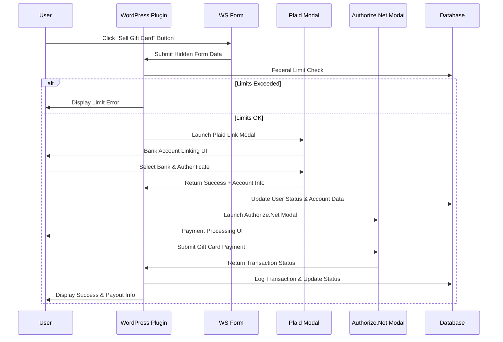

# WordPress Modal Integration Architecture
## Plaid + Authorize.Net Modal Coordination System

### Executive Summary

This architecture document focuses on **modal integration patterns** for WordPress plugin development, specifically coordinating between Plaid Link Modal and Authorize.Net Accept.js Modal. This approach eliminates PCI DSS compliance requirements by ensuring all payment data is handled within third-party modals, with our WordPress plugin serving as the orchestrator and status tracker.

**Key Architectural Benefits:**
- **No PCI DSS Compliance Required** - Payment data never touches our servers
- **No GDPR Compliance Needed** - US-only operations for next 10+ years
- **Simplified Security Model** - Focus on modal coordination vs. data protection
- **Extensible Design** - Built for future expansion and feature additions
- **Modal-First Approach** - Third-party modals handle sensitive operations

## 1. Modal Integration Overview

### 1.1 Modal Workflow Coordination



### 1.2 Core Modal Integration Principles

1. **Modal Encapsulation**: Each modal handles its own security and compliance
2. **Event-Driven Communication**: WordPress plugin responds to modal events
3. **Status Orchestration**: Plugin coordinates workflow between modals
4. **Database Logging**: All status changes and events logged for audit
5. **Error Recovery**: Graceful handling of modal failures with user feedback

## 2. Component Architecture

### 2.1 Modal Coordination Layer

```php
<?php
namespace WPAdminOptimizer\Modal;

class ModalCoordinator {
    private PlaidModalHandler $plaidHandler;
    private AuthorizeNetModalHandler $authorizeHandler;
    private UserStatusManager $statusManager;
    private TransactionLogger $logger;
    
    public function initiateGiftCardWorkflow(int $userId, array $formData): array {
        // 1. Federal limit check
        if (!$this->checkFederalLimits($userId, $formData['amount'])) {
            return $this->handleLimitExceeded($userId);
        }
        
        // 2. Launch Plaid Modal sequence
        return $this->launchPlaidModal($userId, $formData);
    }
    
    public function handlePlaidSuccess(int $userId, array $plaidData): array {
        // Update user status and account info
        $this->statusManager->transitionRole($userId, 'subscriber', 'plaid_user');
        
        // Identity verification and RTP capability check
        if (!$this->validateBankCompatibility($plaidData)) {
            return $this->handleIncompatibleBank($userId);
        }
        
        // Proceed to payment modal
        return $this->launchAuthorizeNetModal($userId, $plaidData);
    }
    
    public function handleAuthorizeNetSuccess(int $userId, array $transactionData): array {
        // Update final status and initiate payout
        $this->statusManager->transitionRole($userId, 'plaid_user', 'payment_user');
        
        // Log successful transaction
        $this->logger->logTransaction($userId, $transactionData);
        
        // Initiate payout through Plaid modal
        return $this->initiatePayout($userId, $transactionData);
    }
}
```

### 2.2 Modal Event Handlers

```php
<?php
namespace WPAdminOptimizer\Modal;

class PlaidModalHandler {
    private EventLogger $logger;
    private UserStatusManager $statusManager;
    
    public function handleModalEvents(): void {
        // WordPress AJAX handlers for Plaid modal events
        add_action('wp_ajax_plaid_modal_success', [$this, 'handleSuccess']);
        add_action('wp_ajax_plaid_modal_error', [$this, 'handleError']);
        add_action('wp_ajax_plaid_modal_exit', [$this, 'handleExit']);
    }
    
    public function handleSuccess(): void {
        $userId = get_current_user_id();
        $plaidData = $this->sanitizePlaidResponse($_POST);
        
        // Log the successful linking
        $this->logger->logEvent('plaid_link_success', $userId, $plaidData);
        
        // Update user status
        $this->statusManager->updateBankLinkingStatus($userId, 'linked', $plaidData);
        
        // Return next step instructions
        wp_send_json_success([
            'next_action' => 'authorize_net_modal',
            'message' => 'Bank account linked successfully'
        ]);
    }
    
    public function handleError(): void {
        $userId = get_current_user_id();
        $errorData = $this->sanitizeErrorResponse($_POST);
        
        // Log the error
        $this->logger->logEvent('plaid_link_error', $userId, $errorData);
        
        // Reset user status
        $this->statusManager->resetUserStatus($userId);
        
        wp_send_json_error([
            'message' => 'Bank account linking failed. Please try again.',
            'error_code' => $errorData['error_code'] ?? 'unknown'
        ]);
    }
}
```

### 2.3 Status Management System

```php
<?php
namespace WPAdminOptimizer\Core;

class UserStatusManager {
    private const VALID_TRANSITIONS = [
        'subscriber' => ['plaid_user'],
        'plaid_user' => ['transaction_user', 'subscriber'],
        'transaction_user' => ['payment_user', 'subscriber'],
        'payment_user' => ['subscriber']
    ];
    
    private DatabaseLogger $dbLogger;
    
    public function transitionRole(int $userId, string $fromRole, string $toRole): bool {
        // Validate transition
        if (!$this->isValidTransition($fromRole, $toRole)) {
            throw new InvalidRoleTransitionException(
                "Invalid transition from {$fromRole} to {$toRole}"
            );
        }
        
        // Execute transition
        $user = new WP_User($userId);
        $user->remove_role($fromRole);
        $user->add_role($toRole);
        
        // Log the transition
        $this->dbLogger->logStatusChange([
            'user_id' => $userId,
            'from_role' => $fromRole,
            'to_role' => $toRole,
            'timestamp' => current_time('mysql'),
            'source' => 'modal_workflow'
        ]);
        
        // Set expiration for temporary roles
        if (in_array($toRole, ['plaid_user', 'transaction_user', 'payment_user'])) {
            $this->setRoleExpiration($userId, $toRole, '+30 minutes');
        }
        
        return true;
    }
    
    public function resetUserStatus(int $userId): void {
        $user = new WP_User($userId);
        
        // Remove all temporary roles
        foreach (['plaid_user', 'transaction_user', 'payment_user'] as $role) {
            $user->remove_role($role);
        }
        
        // Ensure subscriber role
        $user->add_role('subscriber');
        
        // Clear session data
        $this->clearUserSession($userId);
    }
}
```

## 3. Database Schema for Modal Coordination

### 3.1 Modal Event Tracking

```sql
-- Modal events and status tracking
CREATE TABLE wp_modal_events (
    id BIGINT(20) UNSIGNED AUTO_INCREMENT PRIMARY KEY,
    user_id BIGINT(20) UNSIGNED NOT NULL,
    event_type ENUM('plaid_modal', 'authorize_modal', 'status_change') NOT NULL,
    event_action VARCHAR(50) NOT NULL,
    event_data JSON,
    status ENUM('success', 'error', 'pending') NOT NULL,
    created_at TIMESTAMP DEFAULT CURRENT_TIMESTAMP,
    
    INDEX idx_user_id (user_id),
    INDEX idx_event_type (event_type),
    INDEX idx_status (status),
    INDEX idx_created_at (created_at),
    
    FOREIGN KEY (user_id) REFERENCES wp_users(ID) ON DELETE CASCADE
) ENGINE=InnoDB DEFAULT CHARSET=utf8mb4 COLLATE=utf8mb4_unicode_ci;

-- User workflow status tracking
CREATE TABLE wp_user_workflow_status (
    id BIGINT(20) UNSIGNED AUTO_INCREMENT PRIMARY KEY,
    user_id BIGINT(20) UNSIGNED NOT NULL UNIQUE,
    current_step ENUM('initial', 'bank_linking', 'payment_processing', 'payout', 'complete') DEFAULT 'initial',
    plaid_status ENUM('pending', 'linked', 'verified', 'failed') DEFAULT 'pending',
    payment_status ENUM('pending', 'authorized', 'captured', 'failed') DEFAULT 'pending',
    payout_status ENUM('pending', 'processing', 'completed', 'failed') DEFAULT 'pending',
    workflow_data JSON,
    last_activity TIMESTAMP DEFAULT CURRENT_TIMESTAMP ON UPDATE CURRENT_TIMESTAMP,
    expires_at TIMESTAMP NULL,
    
    INDEX idx_user_id (user_id),
    INDEX idx_current_step (current_step),
    INDEX idx_last_activity (last_activity),
    INDEX idx_expires_at (expires_at),
    
    FOREIGN KEY (user_id) REFERENCES wp_users(ID) ON DELETE CASCADE
) ENGINE=InnoDB DEFAULT CHARSET=utf8mb4 COLLATE=utf8mb4_unicode_ci;

-- Transaction coordination log
CREATE TABLE wp_transaction_coordination (
    id BIGINT(20) UNSIGNED AUTO_INCREMENT PRIMARY KEY,
    user_id BIGINT(20) UNSIGNED NOT NULL,
    workflow_id VARCHAR(255) NOT NULL,
    gift_card_amount DECIMAL(10,2) NOT NULL,
    net_payout DECIMAL(10,2) NOT NULL,
    plaid_account_id VARCHAR(255),
    authorize_transaction_id VARCHAR(255),
    coordination_status ENUM('initiated', 'bank_linked', 'payment_authorized', 'payout_completed') NOT NULL,
    error_message TEXT NULL,
    created_at TIMESTAMP DEFAULT CURRENT_TIMESTAMP,
    updated_at TIMESTAMP DEFAULT CURRENT_TIMESTAMP ON UPDATE CURRENT_TIMESTAMP,
    
    INDEX idx_user_id (user_id),
    INDEX idx_workflow_id (workflow_id),
    INDEX idx_coordination_status (coordination_status),
    INDEX idx_created_at (created_at),
    
    FOREIGN KEY (user_id) REFERENCES wp_users(ID) ON DELETE CASCADE
) ENGINE=InnoDB DEFAULT CHARSET=utf8mb4 COLLATE=utf8mb4_unicode_ci;
```

## 4. Error Handling for Modal Failures

### 4.1 Modal Error Recovery System

```php
<?php
namespace WPAdminOptimizer\ErrorHandling;

class ModalErrorHandler {
    private UserStatusManager $statusManager;
    private NotificationManager $notificationManager;
    private ErrorLogger $errorLogger;
    
    public function handlePlaidModalError(int $userId, array $errorData): array {
        $errorType = $errorData['error_type'] ?? 'unknown';
        
        switch ($errorType) {
            case 'item_login_required':
                return $this->handleReauthRequired($userId);
                
            case 'insufficient_credentials':
                return $this->handleInvalidCredentials($userId);
                
            case 'institution_not_supported':
                return $this->handleUnsupportedBank($userId);
                
            case 'user_permission_revoked':
                return $this->handlePermissionRevoked($userId);
                
            default:
                return $this->handleGenericError($userId, $errorData);
        }
    }
    
    public function handleAuthorizeNetModalError(int $userId, array $errorData): array {
        $errorCode = $errorData['error_code'] ?? 'unknown';
        
        switch ($errorCode) {
            case 'declined':
                return $this->handlePaymentDeclined($userId, $errorData);
                
            case 'expired_card':
                return $this->handleExpiredCard($userId);
                
            case 'insufficient_funds':
                return $this->handleInsufficientFunds($userId);
                
            case 'invalid_card':
                return $this->handleInvalidCard($userId);
                
            default:
                return $this->handlePaymentError($userId, $errorData);
        }
    }
    
    private function handleReauthRequired(int $userId): array {
        // Log the reauth requirement
        $this->errorLogger->logError('plaid_reauth_required', $userId);
        
        // Reset user status but preserve session data
        $this->statusManager->resetToSubscriber($userId, $preserveSession = true);
        
        return [
            'action' => 'retry_bank_linking',
            'message' => 'Please re-authenticate with your bank to continue.',
            'retry_delay' => 0
        ];
    }
    
    private function handlePaymentDeclined(int $userId, array $errorData): array {
        // Log the declined payment
        $this->errorLogger->logError('payment_declined', $userId, $errorData);
        
        // Keep user in current state for retry
        return [
            'action' => 'retry_payment',
            'message' => 'Your payment was declined. Please check your gift card details and try again.',
            'retry_delay' => 300 // 5 minutes
        ];
    }
}
```

### 4.2 User Experience for Modal Failures

```javascript
// Frontend modal error handling
class ModalErrorManager {
    constructor() {
        this.retryDelays = new Map();
        this.maxRetries = 3;
    }
    
    handlePlaidError(error, userId) {
        const errorType = error.error_type;
        const retryCount = this.getRetryCount(userId, 'plaid');
        
        switch (errorType) {
            case 'item_login_required':
                this.showReauthMessage();
                this.enableRetry(userId, 'plaid', 0);
                break;
                
            case 'institution_not_supported':
                this.showUnsupportedBankMessage();
                this.disableRetry(userId, 'plaid');
                break;
                
            case 'user_permission_revoked':
                this.showPermissionMessage();
                this.resetWorkflow(userId);
                break;
                
            default:
                if (retryCount < this.maxRetries) {
                    this.showGenericErrorWithRetry(error);
                    this.enableRetry(userId, 'plaid', 5000); // 5 second delay
                } else {
                    this.showMaxRetriesReached();
                    this.resetWorkflow(userId);
                }
        }
    }
    
    handleAuthorizeNetError(error, userId) {
        const errorCode = error.error_code;
        const retryCount = this.getRetryCount(userId, 'authorize');
        
        switch (errorCode) {
            case 'declined':
                this.showDeclinedMessage();
                this.enableRetry(userId, 'authorize', 0);
                break;
                
            case 'expired_card':
                this.showExpiredCardMessage();
                this.enableRetry(userId, 'authorize', 0);
                break;
                
            case 'insufficient_funds':
                this.showInsufficientFundsMessage();
                this.disableRetry(userId, 'authorize');
                break;
                
            default:
                if (retryCount < this.maxRetries) {
                    this.showGenericPaymentErrorWithRetry(error);
                    this.enableRetry(userId, 'authorize', 10000); // 10 second delay
                } else {
                    this.showPaymentMaxRetriesReached();
                    this.resetWorkflow(userId);
                }
        }
    }
    
    showReauthMessage() {
        this.displayUserMessage(
            'Bank Authentication Required',
            'Your bank session has expired. Please click "Continue" to re-authenticate.',
            'warning'
        );
    }
    
    showDeclinedMessage() {
        this.displayUserMessage(
            'Payment Declined',
            'Your gift card payment was declined. Please verify your gift card details and try again.',
            'error'
        );
    }
    
    displayUserMessage(title, message, type) {
        // WordPress admin notice style messaging
        const noticeClass = `notice notice-${type} is-dismissible`;
        const noticeHtml = `
            <div class="${noticeClass}">
                <h3>${title}</h3>
                <p>${message}</p>
                <button type="button" class="notice-dismiss"></button>
            </div>
        `;
        
        jQuery('#modal-messages').html(noticeHtml);
    }
}
```

## 5. Extensible Plugin Architecture

### 5.1 Plugin Extension Framework

```php
<?php
namespace WPAdminOptimizer\Extensions;

abstract class ModalExtension {
    protected string $name;
    protected string $version;
    protected array $dependencies = [];
    
    abstract public function initialize(): void;
    abstract public function getModalHandlers(): array;
    abstract public function getDatabaseSchema(): array;
    
    public function register(): void {
        // Register extension with main plugin
        do_action('wpado_register_extension', $this);
        
        // Hook into modal workflow
        add_filter('wpado_modal_workflow_steps', [$this, 'addWorkflowSteps']);
        add_filter('wpado_modal_handlers', [$this, 'registerHandlers']);
    }
    
    public function addWorkflowSteps(array $steps): array {
        return array_merge($steps, $this->getWorkflowSteps());
    }
    
    protected function getWorkflowSteps(): array {
        return [];
    }
}

// Example extension for additional payment methods
class PayPalModalExtension extends ModalExtension {
    protected string $name = 'PayPal Modal Integration';
    protected string $version = '1.0.0';
    
    public function initialize(): void {
        add_action('wpado_payment_method_selection', [$this, 'addPayPalOption']);
        add_action('wp_ajax_paypal_modal_success', [$this, 'handlePayPalSuccess']);
    }
    
    public function getModalHandlers(): array {
        return [
            'paypal_modal' => new PayPalModalHandler()
        ];
    }
    
    public function getDatabaseSchema(): array {
        return [
            'wp_paypal_transactions' => $this->getPayPalTableSchema()
        ];
    }
    
    protected function getWorkflowSteps(): array {
        return [
            'paypal_payment' => [
                'name' => 'PayPal Payment Processing',
                'modal' => 'paypal_modal',
                'success_action' => 'handle_paypal_success',
                'error_action' => 'handle_paypal_error'
            ]
        ];
    }
}
```

### 5.2 Configuration Management for Extensions

```php
<?php
namespace WPAdminOptimizer\Configuration;

class ExtensionManager {
    private array $registeredExtensions = [];
    private ConfigurationStore $config;
    
    public function registerExtension(ModalExtension $extension): void {
        $this->registeredExtensions[$extension->getName()] = $extension;
        
        // Create extension database tables
        $this->createExtensionTables($extension);
        
        // Load extension configuration
        $this->loadExtensionConfig($extension);
    }
    
    public function getActiveExtensions(): array {
        return array_filter($this->registeredExtensions, function($extension) {
            return $this->config->get("extensions.{$extension->getName()}.active", false);
        });
    }
    
    public function enableExtension(string $extensionName): bool {
        if (!isset($this->registeredExtensions[$extensionName])) {
            return false;
        }
        
        $extension = $this->registeredExtensions[$extensionName];
        
        // Check dependencies
        if (!$this->checkDependencies($extension)) {
            throw new ExtensionDependencyException(
                "Extension {$extensionName} has unmet dependencies"
            );
        }
        
        // Initialize extension
        $extension->initialize();
        
        // Mark as active
        $this->config->set("extensions.{$extensionName}.active", true);
        
        return true;
    }
    
    private function createExtensionTables(ModalExtension $extension): void {
        $schemas = $extension->getDatabaseSchema();
        
        foreach ($schemas as $tableName => $schema) {
            $this->createTable($tableName, $schema);
        }
    }
}
```

## 6. Future Expansion Considerations

### 6.1 Additional Modal Integration Points

The architecture is designed to easily accommodate additional modal-based services:

1. **Additional Payment Processors**
   - Stripe Modal Integration
   - PayPal Modal Integration
   - Square Modal Integration

2. **Additional Banking Services**
   - Yodlee Modal Integration
   - MX Modal Integration
   - Finicity Modal Integration

3. **Identity Verification Services**
   - Jumio Modal Integration
   - Persona Modal Integration
   - Onfido Modal Integration

### 6.2 Workflow Extension Framework

```php
<?php
namespace WPAdminOptimizer\Workflow;

class WorkflowManager {
    private array $workflowSteps = [];
    private array $modalHandlers = [];
    
    public function addWorkflowStep(string $stepName, array $stepConfig): void {
        $this->workflowSteps[$stepName] = $stepConfig;
    }
    
    public function executeWorkflow(int $userId, string $workflowName): WorkflowResult {
        $workflow = $this->getWorkflow($workflowName);
        $context = new WorkflowContext($userId);
        
        foreach ($workflow->getSteps() as $step) {
            $result = $this->executeStep($step, $context);
            
            if ($result->isFailed()) {
                return $result;
            }
            
            $context->addStepResult($step->getName(), $result);
        }
        
        return WorkflowResult::success($context);
    }
}
```

This modal integration architecture provides a robust foundation for WordPress plugin development that coordinates between third-party services while maintaining extensibility for future enhancements. The focus on modal integration eliminates compliance complexity while providing a scalable foundation for growth.